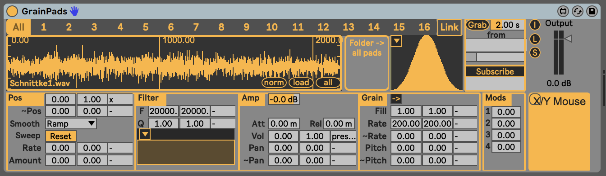
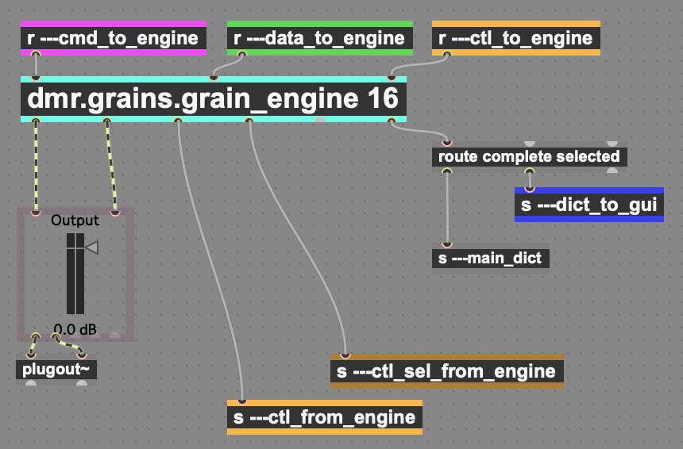

# GranularSynth

This is a granular synth engine, based on the [rgr.grains](https://github.com/mo-seph/rgr.grains) package.

There are two main things to play with here:
- The GrainPads M4L Instrument is a reasonably well tested synth whose superpower is maping multidimensional control data to grain parameters. 
- The actual GrainSynth engine that makes all of this happen. There is `dmr.grains.grain_engine`, which is a multi-voice grain synth, using `dmr.grains.grain_voice` for each voice. 

# Operation

The engine has a number of voices, each of which can have its own set of parameters, covering grains, filter, amplitude and buffer sources. It's mostly set up to make it easy to use multidimensional control data to play grains in expressive or at least dynamic ways.

All of the parameters are stored in a big dictionary. Most parameters are set as a base value, a modulated value, and a modulation source. So e.g. Position could be set with `0` as a base value and `1.0` as a modulated value, and `x` as the modulation source. This would set things up so that as someone moved their finger on the pad from left to right, it sweeps through the sample.

There are two kinds of message:
- `data` messages set parameters (and their ranges/modulation values). These are slighly expensive due to storing in the dictionary and setting GUI state etc.
- `ctl` messages are analagous to MIDI messages, and are the rapidly changing streams of data from pads, LFOs etc. All tagged numeric messages, e.g. `x 0.01`. They are all assumed to fit in the range `0 .. 1`
- `cmd` messages do things like loading files, normalising buffers, that do not need to get stored in the dictionary.

In the example above, the parameter range (`0.0 .. 1.0`) and modulation source (`x`) are set using `data` messages, and then as the user sweeps their finger, lots of `x 0.001, x 0.002` style messages would come out and do the actual modulation.

The engine always has one currently selected voice, to make it easy to write GUI stuff around it.

## Message Detail

Messages are generally prepended with the voice, which can be a number (`1 .. num voices`), `0` for all, or `current` for the current voice.

- *`ctl`* : (seen through `ctl_to_engine` in the patches) fast moving data, with the format `<voice> <dimension> <value>` e.g.:
  - `1 x 0.4` to set x to 0.4 for voice number 1
  - `0 mod1 0.2` to set `mod1` to 0.2 for all voices

- *`data`*: (seen through `data_to_engine` in the patches): set a part of a parameter, with format `<voice> <path::to::param> <value>`, e.g.:
  * `current parameters::loop_start::high 0.5` sets the modulated value of `loop_start` to top out at 0.5
